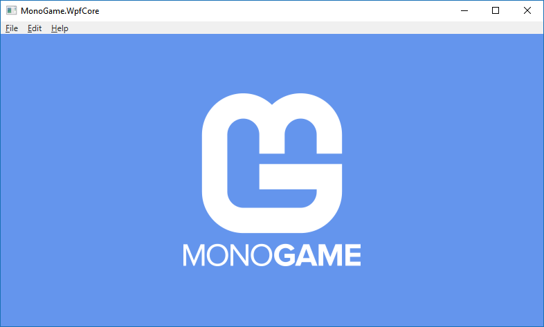

# MonoGame.WpfCore

MonoGame embedded inside a WPF app as a `dotnet new` template.



## Getting started.

The easiest way to install the `dotnet new` template is to clone this repository locally and [install the template from a local directroy](https://docs.microsoft.com/en-us/dotnet/core/tools/custom-templates#to-install-a-template-from-a-file-system-directory):

```
dotnet new -i MonoGame.WpfCore\
```

After the template is installed you should see it in the list. To create a new project create an empty directory and run the template.

```
mkdir MyLevelEditor
cd MyLevelEditor
dotnet new monogamewpf
```

All done! Open the solution and run the project.

## Simple. 

There's no magic here.

 - The WPF project references the official [`MonoGame.Framework.WindowsDX` NuGet package](https://www.nuget.org/packages/MonoGame.Framework.WindowsDX/). This same one that can be used in your game.
 - There's only a handful of files required to do the heavy lifting. 
 - The `MonoGameContentControl` is a standard WPF control in every other way.

## Modern. 

I've been using and refining the `MonoGameContentControl` in my projects for many years. Everything else in this template was built from the ground up using the latest .NET technologies.

 - Thanks to the new `UseWPF` flag introduce in .NET Core 3.0 we can build WPF projects in the new `csproj` format.
 
## Customizable.

All of the code used to embed MonoGame in WPF is included in this template. You can edit and customize it however you like. 

 - The template includes a `MonoGameViewModel` as an example of how to get started. If you use a different view model architecture it's easy to change.
 - The project references the `MonoGame.Content.Builder` package so that it can automatically build your `Content.mgcb` file and you can load content using the `Content` manager. If your editor doesn't need this you can simply remove it.

